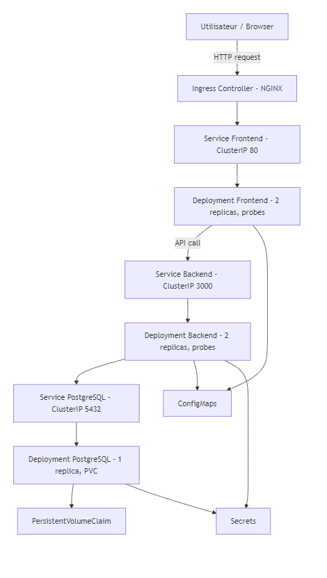

# Architecture Hugo Jarry

## Vue générale

Pour ce projet, j’ai déployé une **application 3-tiers** : frontend, backend, et base de données.
Les flux sont simples :
Frontend <--> Backend <--> Base de données (PostgreSQL)

- **Frontend** : Application web React (SPA) affichant la liste des items et permettant de créer de nouveaux items. 
- **Backend** : API REST en Node.js + Express, gérant le CRUD minimal pour les items. 
- **Base de données** : PostgreSQL pour la persistance, avec fallback en mémoire si DB désactivée. 
- **CI/CD** : GitHub Actions + Docker + Kubernetes pour build, push, et déploiement. 

## Flux des données

1. L’utilisateur interagit avec le frontend (SPA). 
2. Le frontend envoie des requêtes HTTP à l’API backend (`/items` ou `/healthz`). 
3. Le backend traite la requête : 
   - Lecture/écriture en mémoire si PostgreSQL n’est pas activé. 
   - Ou interaction avec la base PostgreSQL pour persister les données. 
4. La réponse est renvoyée au frontend pour affichage. 

## Choix techniques et justification

- **Node.js / Express** : léger et rapide pour construire une API REST simple. 
- **React** : SPA moderne, facile à déployer dans un conteneur. 
- **PostgreSQL** : persistance fiable et supporte le PVC pour le stockage dynamique dans Kubernetes. 
- **Docker** : conteneurisation front/back pour CI/CD et déploiement cohérent. 
- **Kubernetes (kind)** : orchestrateur local pour tester le scaling, les probes et les déploiements sans downtime.
- **GitHub Actions** : pipeline CI/CD pour builder, tester, scanner, et pousser les images sur Docker Hub.
- **Supertest + Jest** : tests unitaires backend pour garantir la stabilité des endpoints.

## Notes personnelles

- J’ai mis en place les **replicas et probes** dans Kubernetes pour backend et frontend.
- Les manifests incluent ConfigMaps et Secrets pour configurer le backend et la DB.
- Le frontend est exposé via un **Ingress NGINX** pour tester l’accès HTTP.
- J’ai documenté les commandes pour vérifier l’état des pods, services et volumes persistants dans le runbook.

---

Cette architecture permet de **tester localement** l’ensemble des composants tout en respectant les bonnes pratiques de containerisation et orchestration.

## Diagramme d'architecture

Problème de mermaid sur github donc capture d'écran du mermaid

